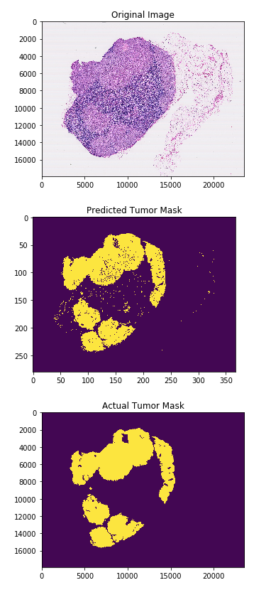

# camelyon-ai
Implementation of a CNN for tumor classification in the [Camelyon17 Grand Challenge](https://camelyon17.grand-challenge.org/)

# Code Structure
At the moment, there are two ways of running the camelyon-ai code bank to detect breast cancer metastases. The first, through `train_and_test.ipynb`, is the recommended method, as it conserves memory and allows for easy manipulation of the CNN topology to test the performance of different networks. `train_and_test.ipynb` calls two helper scripts, `training.py` and `testing.py`.

The second method uses `camelyon_single_script.ipynb` and is most helpful when debugging.  

# Requirements
Coming soon. 

# Example Prediction

