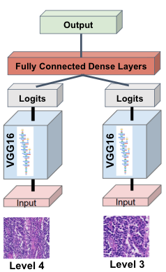

# camelyon-ai
Implementation of a CNN for tumor classification in the [Camelyon16 Grand Challenge](https://camelyon17.grand-challenge.org/)

# Code Structure
There are two ways of running the camelyon-ai code to detect breast cancer metastases. The first, and highly recomended method is to use `train_and_test.ipynb`. This enables training on more images with the dual model architure. It does require the setup of the a virtual machine (instructions are discussed below).

The second method of running the cameylon-ai detection network uses `camelyon_single_script.ipynb`. This script runs in Google Colab. Due to memory restrictions in Colab it only trains on a fraction of the data, and doesn't use the dual model architecture. 

# Requirements
1. [OpenSlide](https://openslide.org/download/) 3.4.1 (C library). If installing through [GitHub](https://github.com/openslide/openslide), additional packages are required, all of which can be found in the Readme.   
2. OpenSlide Python
3. tensorflow-gpu (Conda [distribution](https://anaconda.org/anaconda/tensorflow-gpu))
4. matplotlib
5. numpy
6. scikit-image
7. scikit-learn
8. pandas
9. opencv-python

Other notes: 
OpenSlide 3.4.1  is required, as early versions of the package do not support Phillips TIFF, the format of the annotated whole slide images (WSI).  

# Implementation
Due to the amount of training data and the parallel network architecture of the camelyon-ai CNN, training requires the significant computational resources. For our purposes, we set up a virtual machine in Google Cloud Console with 8vCPUs (52 GB RAM), 2 NVIDIA Tesla K80s (24 GB RAM) and 125 GB of disk space. The CUDA and cuDNN libraries were required to utilize the GPUs. 

## Model Architecture
Our model implements a parallel network architecture. Image context is important for tumor classification, and by training on inputs at multiple zoom levels, our model accounts for both local iamge characteristics and relevant surrounding features. 

## Model Specifics
Our model achieves optimal performance with a VGG16 convolutional base, input images at zoom levels 3 and ###, and a T% confidence threshold for tumor prediction. For these specification, model validation results in a mean F1 score of 0.%%%. 

# Example Prediction

